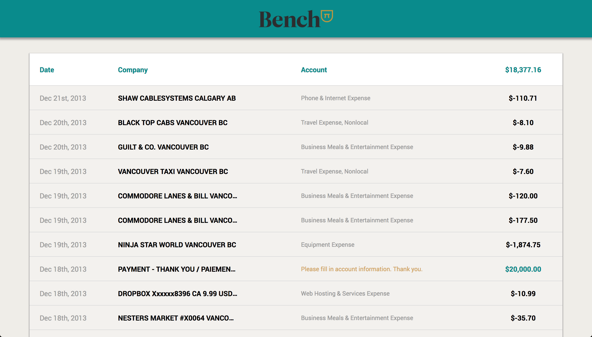
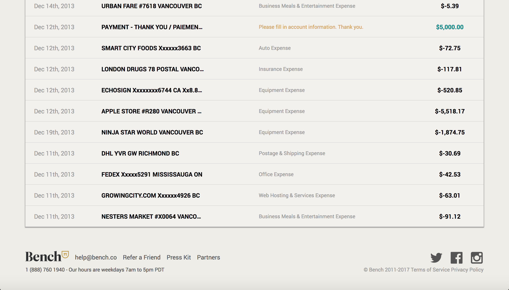

# Bench-restTest

The Bench-restTest is an exercise to help demonstrate the ability to reason about JSON REST API's and data transformations. This web app is connected
to an API and presents the data on a balance-sheet-like user interface, and adds up the total balance using the amount values inside of the data object.

This was a very fun project to work on. The challenge allowed to me demonstrate my understanding of JSON REST API's and data transformations.
An initial hurdle that I ran into was that the object keys inside of the API were capitalized, one of them being Date which is a reserved JavaScript identifer.
To fix this, I looped over the JSON and set the keys to lower case.

## Technologies Used
- Javascript (ES6)
- React
- Redux
- JSX
- SASS
- JSON REST API
- Dev tools (Webpack, ESLint, Babel)

## Installation
- Clone or download this repository
- Run yarn inside of the root folder where the package.json file is located
- Run yarn start
